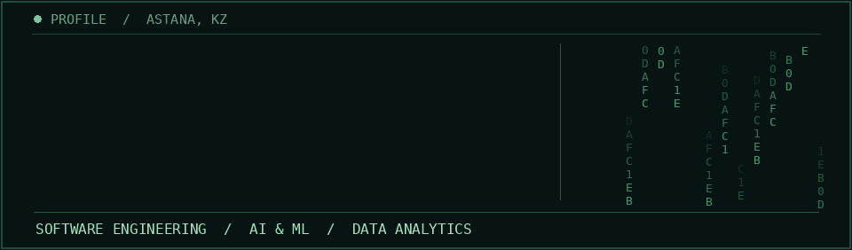

# Talgat Omyrkanov

Software engineer in Astana, Kazakhstan, focused on AI/ML and data analytics. I build learning products and backend services with practical AI integrations. Software Engineering graduate from Astana IT University (2026, GPA 3.45/4.0).

## Selected work

### [ZerdeStudy](https://github.com/Just-everyday-developer/ZerdeStudy_Frontend) · education platform

My university capstone. I built the cross-platform Flutter client and collaborated on a Go-based, eight-service backend and LLM features. The public frontend includes learning tracks, course flows, an AI mentor, and teacher and moderator interfaces. Some content and progress remain local demo state; full API flows need the companion services.

### [ekt.kz Product Assistant](https://github.com/BAITC-Hacks/hack-4cfe9779-k14) · team hackathon project

A team-built storefront and AI product assistant. [My commits](https://github.com/BAITC-Hacks/hack-4cfe9779-k14/commits?author=Just-everyday-developer) include connecting the React storefront to FastAPI catalog and chat endpoints, integration work, tests, and documentation. The repository is an archived prototype; it is not the live ekt.kz chat or shopping cart.

### [Social Media Platform](https://github.com/Just-everyday-developer/Social_Media_Platform) · Dart / Flutter

My main independent Dart/Flutter project: a social app MVP with post creation and editing, feed and profile screens, Firebase-backed authentication and posts, maps, news, and Russian/Kazakh/English localization. Reels, messaging, and notifications are still planned or in progress.

### [KMG-K website prototype](https://github.com/Just-everyday-developer/kmg-karachaganak-website) · Flutter Web

A web prototype exploring a new layout for the Karachaganak site. My commits added news and contact page flows, map integration, and responsive UI fixes. The repository is a prototype, not a claim of a deployed company website.

## Tools I work with

**Backend & data:** Go, REST APIs, PostgreSQL, Redis, Kafka, Docker  
**Client & ML:** Dart / Flutter, Kotlin / Jetpack Compose, Python (core data science stack; scikit-learn, OpenCV), LLM integrations

Outside public repositories, my internships included computer vision for equipment inspection and local LLM and backend work for internal workflows. In a case championship, I worked with a team on demand forecasting from historical spreadsheet data.

## Contact

Astana, Kazakhstan  
[tomyrkanov@gmail.com](mailto:tomyrkanov@gmail.com) · [@just_usual_person](https://t.me/just_usual_person) · [+7 (771) 549 28 59](tel:+77715492859)
