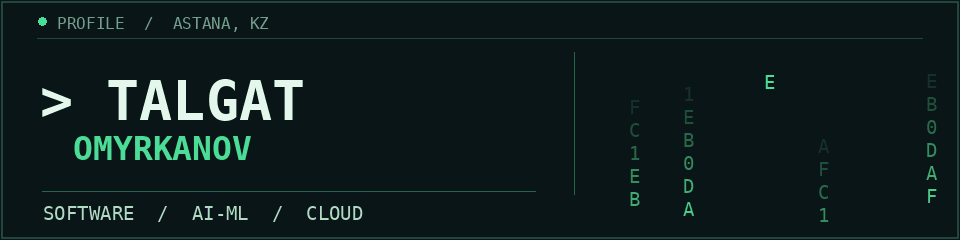

# Talgat Omyrkanov

Software engineer in Astana, Kazakhstan, working across backend, AI/ML, and cloud infrastructure. I build learning products and backend services with practical AI integrations. Software Engineering graduate from Astana IT University (2026).

## Selected work

### [ZerdeStudy](https://github.com/Just-everyday-developer/ZerdeStudy_Frontend) · education platform

My university capstone. I built the cross-platform Flutter client and collaborated on a Go-based, eight-service backend and LLM features. The public frontend includes learning tracks, course flows, an AI mentor, and teacher and moderator interfaces. Some content and progress remain local demo state; full API flows need the companion services.

### [ekt.kz Product Assistant](https://github.com/BAITC-Hacks/hack-4cfe9779-k14) · team hackathon project

A team-built storefront and AI product assistant. [My commits](https://github.com/BAITC-Hacks/hack-4cfe9779-k14/commits?author=Just-everyday-developer) include connecting the React storefront to FastAPI catalog and chat endpoints, integration work, tests, and documentation. The repository is an archived prototype; it is not the live ekt.kz chat or shopping cart.

### [AI Orchestrator Service](https://github.com/Just-everyday-developer/AI-service) · Go backend prototype

An MVP service that sends requests to Gemini, stores state in PostgreSQL, and publishes result events to Kafka via a transactional outbox. The repository also documents its current limits.

### [PageMask](https://github.com/Just-everyday-developer/PageMask-extension) · browser extension

Configurable text and color overlays for web pages that keep their position after a reload. I worked on the popup, editing flow, and extension structure.

## Tools I work with

**Backend & data:** Go, REST APIs, PostgreSQL, Redis, Kafka, Docker  
**Client & ML:** Dart / Flutter, Python, OpenCV, scikit-learn, LLM integrations

Outside public repositories, my internships included computer vision for equipment inspection and local LLM and backend work for internal workflows.

## Contact

Astana, Kazakhstan · [Email](mailto:tomyrkanov@gmail.com)
